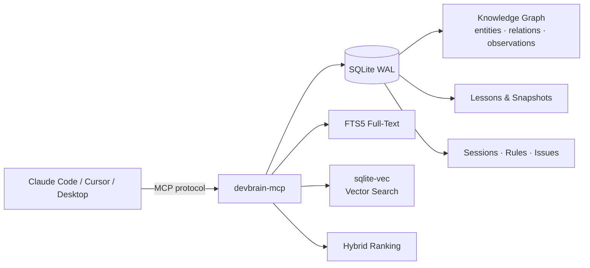

# devbrain-mcp


**Persistent project memory for AI coding agents.**
A [Model Context Protocol](https://modelcontextprotocol.io) server that maintains
a live knowledge graph of your codebase — entities, relations, decisions,
conventions, lessons — so Claude Code (or any MCP-compatible client) picks up
where the last session left off instead of starting from a blank slate.

DevBrain is the memory half of AgentWeave × DevBrain — a companion desktop
IDE for AI-assisted developers, currently in development. It also works standalone.

## Why DevBrain?

LLM coding agents are stateless by design — every session starts from scratch.
For projects that span weeks or months, that means re-explaining the architecture,
the conventions, the past mistakes, and the gotchas every single time.

DevBrain solves this by maintaining a typed knowledge graph of your project that
the agent can query, update, and learn from across sessions. It tracks entities
and relations (files, modules, decisions), records lessons from outcomes, scopes
rules per file pattern or entity type, and exposes everything through 70 MCP
tools that any compatible client (Claude Code, Cursor, Claude Desktop) can use.

Think of it as a long-term memory layer for your coding agent — one that gets
sharper as the project grows, instead of being reset every time.

## Architecture



The agent talks MCP. DevBrain stores everything in a single SQLite file with
WAL mode for concurrent reads, augmented with sqlite-vec for embeddings and
FTS5 for full-text. A hybrid ranker fuses both signals when the agent asks
for context.

## Install

DevBrain isn't on npm yet — install from source:

```bash
git clone https://github.com/Clerks303/devbrain-mcp.git
cd devbrain-mcp
npm install
npm run build
npm link            # exposes `devbrain-mcp` on your PATH
```

`npm link` makes the `devbrain-mcp` binary globally available so MCP clients
(Claude Desktop, Claude Code) can spawn it by name.

## Quick start

### Claude Desktop / Claude Code

Add to your MCP config (e.g. `~/Library/Application Support/Claude/claude_desktop_config.json`):

```json
{
  "mcpServers": {
    "devbrain": {
      "command": "devbrain-mcp",
      "env": {
        "DEVBRAIN_DB_PATH": "~/.devbrain/memory.db",
        "OPENAI_API_KEY": "sk-..."
      }
    }
  }
}
```

Restart the client. DevBrain now appears as a tool provider.

### Configuration (env vars)

All variables are optional; DevBrain runs with sane defaults. See
[`.env.example`](.env.example) for the full annotated list.

| Variable                        | Default                        | Purpose                                              |
|---------------------------------|--------------------------------|------------------------------------------------------|
| `DEVBRAIN_DB_PATH`              | `~/.devbrain/devbrain.db`      | SQLite file (WAL mode, auto-created).                |
| `DEVBRAIN_EMBEDDING_PROVIDER`   | _(inferred)_                   | `openai`, `ollama`, or `none`. Inferred from key presence when unset. |
| `OPENAI_API_KEY`                | —                              | OpenAI key (also `DEVBRAIN_OPENAI_API_KEY`). Used when provider is `openai`. |
| `DEVBRAIN_OLLAMA_BASE_URL`      | `http://localhost:11434`       | Ollama endpoint for local embeddings.                |
| `DEVBRAIN_TRANSPORT`           | `stdio`                        | `stdio` (MCP clients) or `sse`.                      |
| `DEVBRAIN_HOOK_PORT`            | `7384`                         | HTTP port for Claude Code hooks integration.         |
| `DEVBRAIN_ALLOW_EMBEDDING_RECREATE` | _(unset)_                  | Set to `1` to opt in to destructive vec0 table recreate when the embedding dimension changes (e.g. switching openai 1536 ↔ ollama 768). Without this flag, DevBrain refuses to drop existing embeddings. |

## What it gives your agent

DevBrain exposes **70 MCP tools** across these categories:

- **Graph (9)** — entities, relations, observations, projects, traversal.
- **Files (5)** — content-hash digests, symbol extraction, fast file lookup.
- **Search & context (4)** — FTS5 full-text + vector similarity + hybrid ranking + auto-context.
- **Issues (6)** — report / resolve / list / update known bugs and tech debt.
- **Sessions (6)** — session start/end with summary, deltas, resume-with-context.
- **Rules (5)** — project conventions with scope (global / file pattern / entity type).
- **Lessons & learning (11)** — learn from outcomes, recall, reinforce, learning reports & patterns.
- **Goals (13)** — record missions, link entities to goals, suggest next actions.
- **Snapshots (5)** — label state before risky refactors, restore, diff across time.
- **Linking (2)** — bind files to entities / rules / issues.
- **Scan & health (4)** — project scan, DB health, embedding coverage, metrics.

The full authoritative list is surfaced via the MCP `tools/list` request.
Alongside tools, the server also publishes MCP **resources** (browsable
project state) and **prompts**. Three embedding providers are supported —
OpenAI (1536d), Ollama (768d, local) and a NoOp fallback — so search
degrades gracefully instead of failing when no provider is configured.

## Integration with AgentWeave

AgentWeave is the companion desktop app (in development). It spawns
`devbrain-mcp` as a sidecar, proxies the MCP tools over Tauri IPC, and builds
the visual project map and context-builder UI on top.

If AgentWeave finds `devbrain-mcp` on your `PATH` it will use it automatically;
otherwise you can set `DEVBRAIN_SCRIPT_PATH` to point at a local checkout's
`dist/src/index.js` for development.

## Development

```bash
git clone https://github.com/Clerks303/devbrain-mcp.git
cd devbrain-mcp
npm install
npm run build
npm test
```

The suite is 398 Vitest tests across 41 files. Build output goes to `dist/`;
`npm run build` also applies a shebang to binary entry points so `npm link`
produces working CLI shims, and copies the Claude Code hook scripts into
`dist/src/hooks` so they ship in the npm tarball.

## License

MIT
